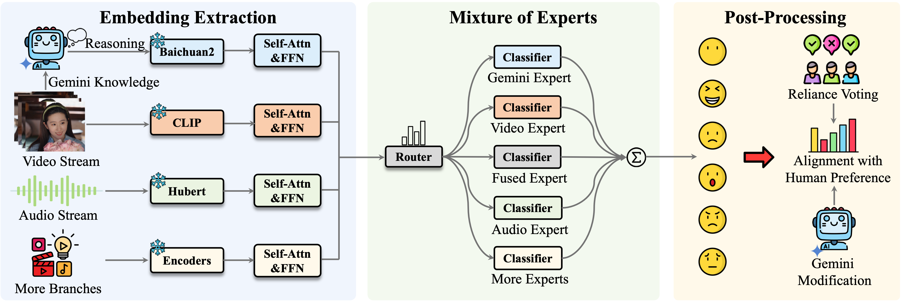

# More Is Better: A MoE-Based Emotion Recognition Framework with Human Preference Alignment (MRAC @ ACM-MM 2025)

[](https://opensource.org/licenses/Apache-2.0)
[](https://arxiv.org/abs/2508.06036)
[](https://github.com/zhuyjan/MER2025-MRAC25/stargazers)

This repository provides our <strong><font color="red">runner-up</font></strong> solution for [MER2025-SEMI challenge](https://zeroqiaoba.github.io/MER2025-website/) at MRAC'25 workshop. If our project helps you, please give us a star ⭐ on GitHub to support us. 🙏🙏

## Overview
<p align="center"></p>

We propose a comprehensive framework, grounded in the principle that "more is better," to construct a robust Mixture of Experts (MoE) emotion recognition system. Our approach integrates a diverse range of input modalities as independent experts, including novel signals such as knowledge from large Vision-Language Models (VLMs) and temporal Action Unit (AU) information.

## Setup
Our environment setup is identical to that of [MERBench](https://github.com/zeroQiaoba/MERTools/tree/master/MERBench).
```bash
conda env create -f environment.yml
```